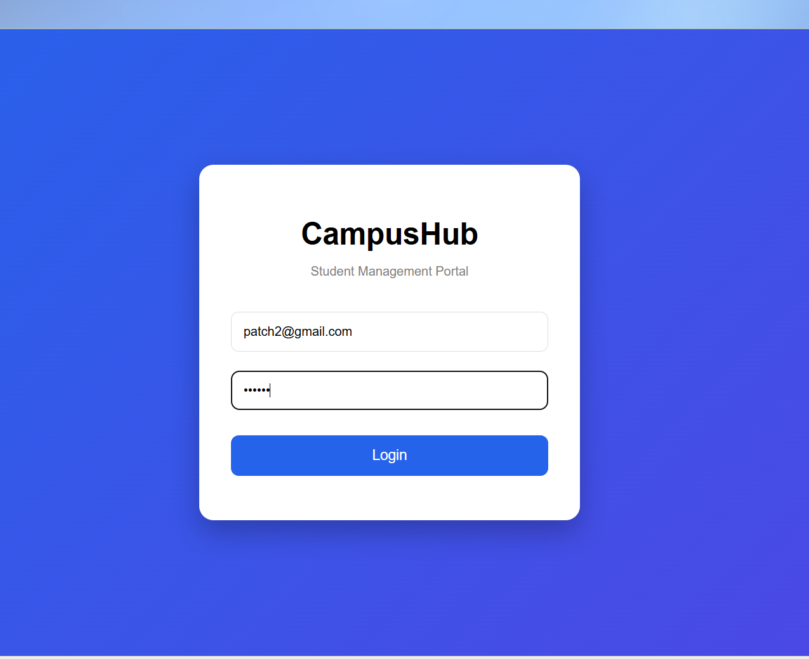
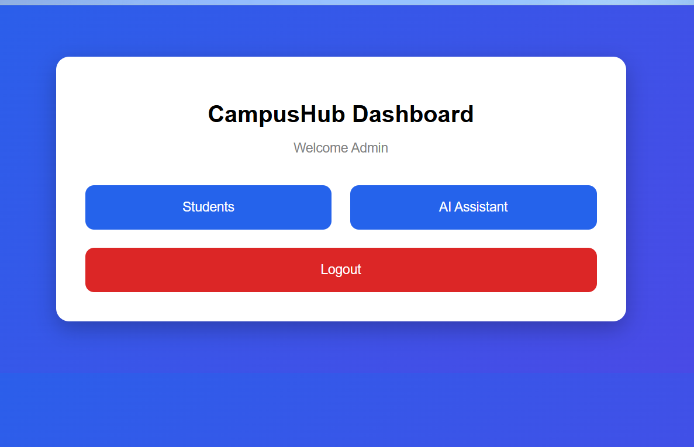
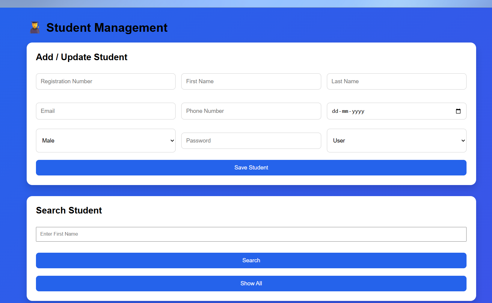
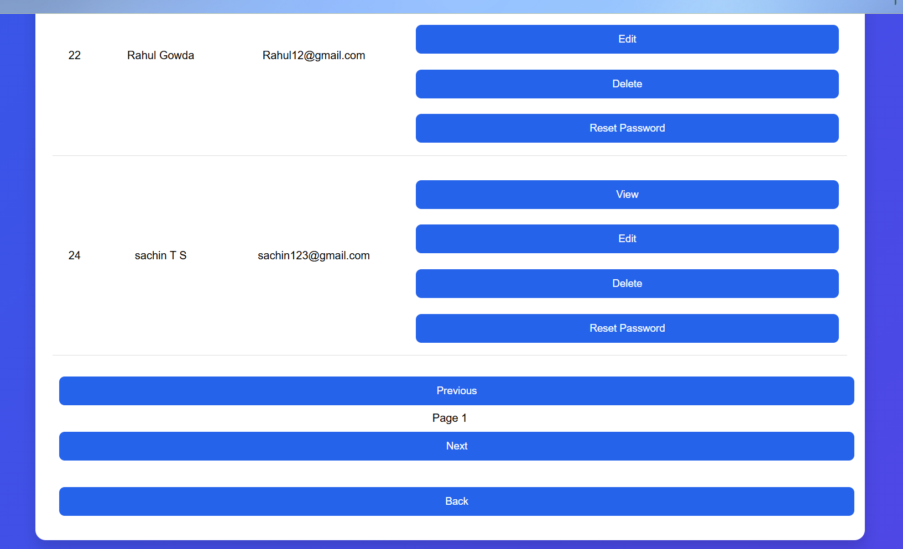
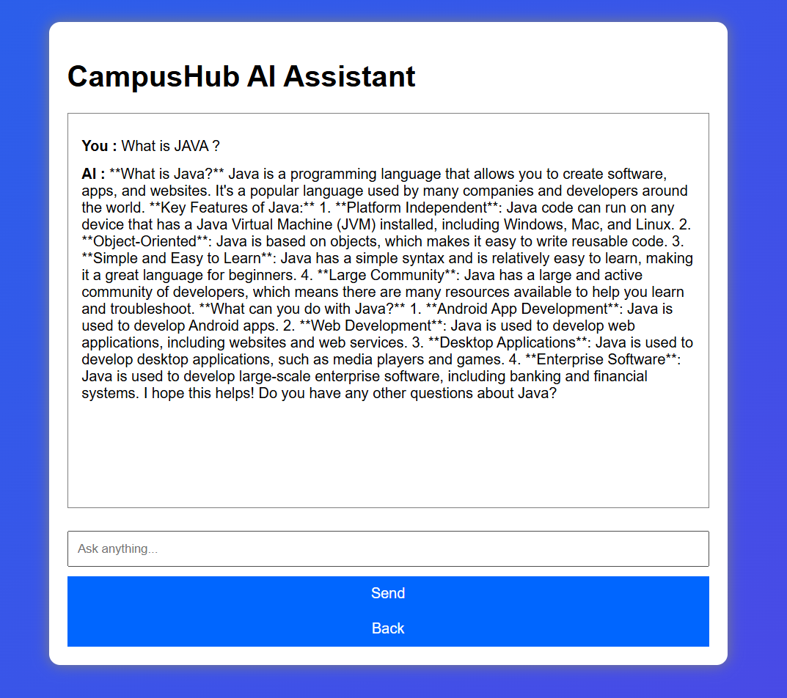
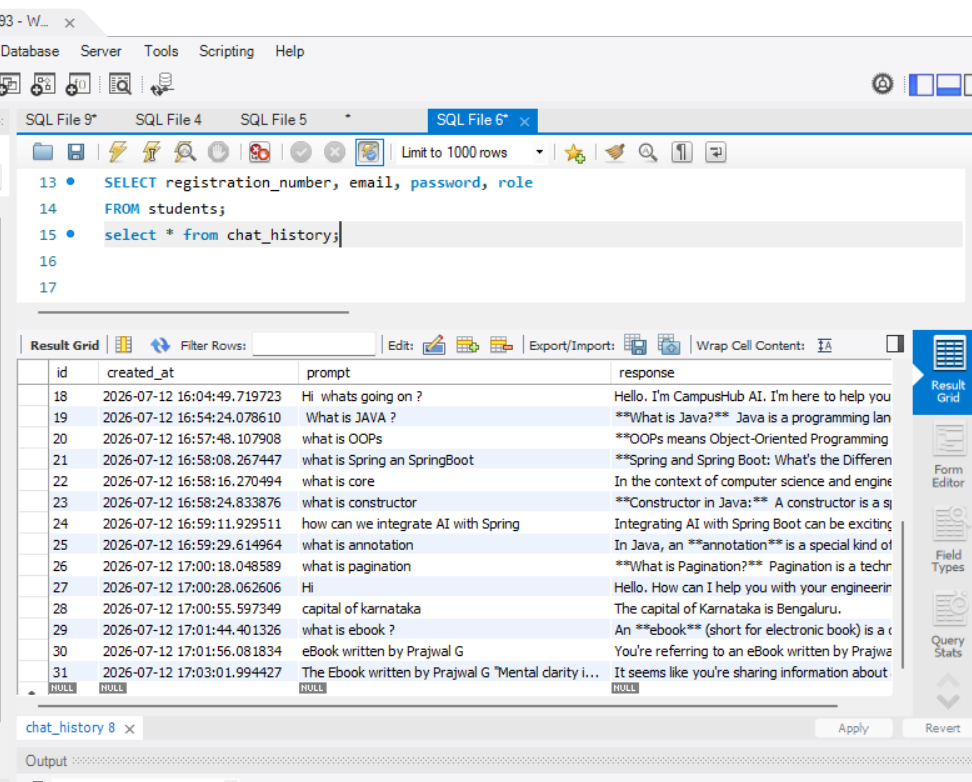
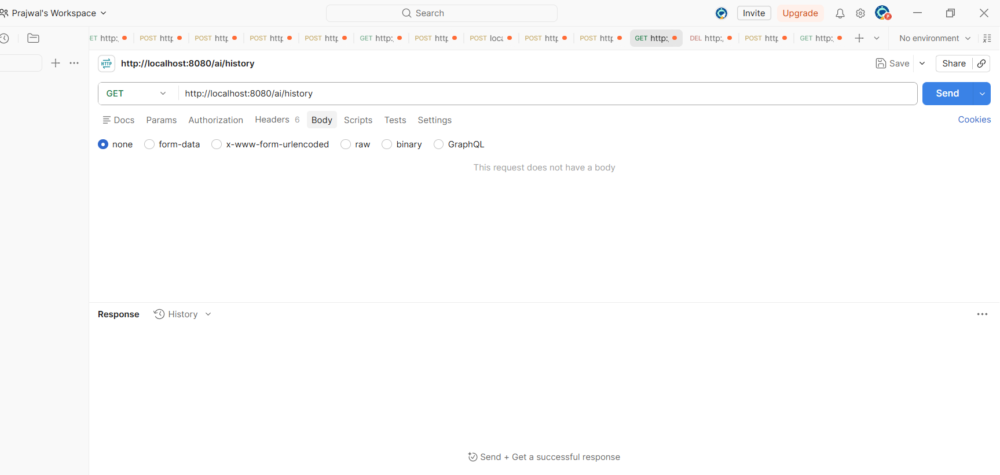
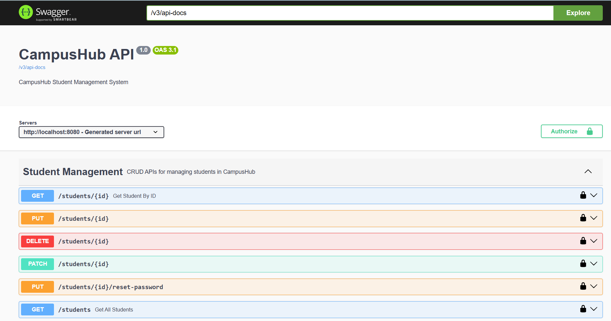

# 🎓 CampusHub

CampusHub is a full-stack Student Management System built using **Java 17**, **Spring Boot**, **MySQL**, **HTML**, **CSS**, and **JavaScript**.

The application provides secure student management with **JWT Authentication**, **Role-Based Authorization**, **REST APIs**, **AI-powered assistance**, and a responsive web interface. It follows a clean layered architecture using DTOs, validation, global exception handling, and secure password encryption with BCrypt.

---

# 📌 Project Highlights

-  Full-Stack Monolithic Web Application
-  Java 17 & Spring Boot
-  Spring Security + JWT Authentication
-  Role-Based Authorization (Admin / User)
-  RESTful APIs
-  DTO Pattern
-  BCrypt Password Encryption
-  Global Exception Handling
-  Pagination & Search
-  AI Chat Assistant (Spring AI + Groq)
-  Chat History stored in MySQL
-  Swagger API Documentation
-  Environment Variable Configuration
-  JUnit 5 & Mockito Unit Testing

---

# 🚀 Features

## 🔐 Authentication & Security

- JWT Authentication
- JWT Token Expiry (30 Minutes)
- Role-Based Authorization
- BCrypt Password Encryption
- Session Expiry Handling
- Environment Variable Configuration
- Secure REST APIs using Spring Security

---

## 👨‍🎓 Student Management

### Admin

- Add Student
- Update Student
- Delete Student
- View Student Details
- Search Student
- Pagination
- Reset Student Password
- View Complete Student Information

### User

- Login
- View Student Details
- Access AI Assistant

---

## 🤖 AI Module

- AI Chat Assistant
- Spring AI Integration
- Groq API Integration
- Chat History stored in MySQL
- Placement and Programming Assistance

---

## 🛡 Validation & Exception Handling

- Email Validation
- Phone Number Validation
- Required Field Validation
- Duplicate Email Validation
- Duplicate Registration Number Validation
- Global Exception Handling
- Custom Exception Handling

---

# 🛠 Tech Stack

## Backend

- Java 17
- Spring Boot
- Spring Security
- Spring Data JPA
- Hibernate
- Maven

---

## Database

- MySQL

---

## Frontend

- HTML5
- CSS3
- JavaScript

---

## AI

- Spring AI
- Groq API

---

## Testing

- JUnit 5
- Mockito

---

## Tools

- IntelliJ IDEA
- MySQL Workbench
- Postman
- Swagger UI
- Git
- GitHub

---

# 🏗 Architecture

```
                Browser
         (HTML + CSS + JavaScript)
                    │
                    │ REST API
                    ▼
          Spring Boot Application
                    │
     ┌──────────────┼──────────────┐
     │              │              │
 Controller      Service      Security
     │              │              │
     └──────────────┼──────────────┘
                    │
              Repository Layer
                    │
                 Hibernate
                    │
                 MySQL Database
```

---

# 📂 Project Structure

```
src/main
│
├── java
│   └── com.prajwal.campushub
│
│       ├── controller
│       ├── service
│       ├── repository
│       ├── entity
│       ├── dto
│       ├── security
│       ├── auth
│       ├── ai
│       └── exception
│
└── resources
    ├── static
    │   ├── css
    │   ├── js
    │   └── html
    └── application.properties
```

---

# 🔐 Roles

## Admin

- Login
- Add Student
- Edit Student
- Delete Student
- Search Student
- Reset Password
- View Student Details
- AI Chat

---

## User

- Login
- View Student Details
- AI Chat

---

# ⚙️ Installation

## 1. Clone Repository

```bash
git clone https://github.com/YOUR_USERNAME/CampusHub.git

cd CampusHub
```

---

## 2. Configure Environment Variables

Create the following Environment Variables before running the application.

```
DB_URL
DB_USERNAME
DB_PASSWORD
JWT_SECRET
GROQ_API_KEY
```

Example

```
DB_URL=jdbc:mysql://localhost:3306/campushub

DB_USERNAME=root

DB_PASSWORD=your_password

JWT_SECRET=your_secret_key

GROQ_API_KEY=your_groq_api_key
```

---

## 3. Run the Project

Using Maven

```bash
mvn clean spring-boot:run
```

OR

Open the project in IntelliJ IDEA and run

```
CampushubApplication.java
```

---

# 🌐 API Documentation

Swagger UI

```
http://localhost:8080/swagger-ui/index.html
```

---

# 🧪 Unit Testing

The project includes unit testing for the Service layer.

Frameworks Used

- JUnit 5
- Mockito

Tested Components

- Student Service
- CRUD Operations
- Business Logic
- Repository Mocking

---

# 💡 Challenges Faced & Solutions

| Challenge | Solution |
|-----------|----------|
| Understanding JWT Authentication | Implemented JWT generation, validation, expiration, and request filtering using Spring Security. |
| Role-Based Authorization | Restricted APIs using `ROLE_ADMIN` and `ROLE_USER` with Spring Security annotations. |
| Protecting Sensitive Data | Used DTOs to avoid exposing passwords and internal entity fields in API responses. |
| Password Security | Encrypted passwords using BCrypt before storing them in MySQL. |
| AI Integration | Integrated Groq AI using Spring AI and stored chat history in MySQL. |
| Environment Variable Configuration | Moved database credentials, JWT secret, and API keys to Environment Variables. |
| Validation Handling | Used Bean Validation and Global Exception Handling to return meaningful error messages. |
| Pagination & Search | Implemented Spring Data JPA pagination and search APIs for efficient data retrieval. |
| Frontend Integration | Connected HTML, CSS, and JavaScript frontend with Spring Boot REST APIs using Fetch API and JWT Authorization headers. |
| Testing | Used JUnit 5 and Mockito to test business logic independently of the database. |

---

# 📚 Key Learnings

- Developed a secure full-stack web application using Spring Boot.
- Gained hands-on experience with JWT Authentication and Spring Security.
- Learned REST API development following layered architecture.
- Improved understanding of DTOs, Validation, Exception Handling, and JPA.
- Integrated AI features using Spring AI and Groq API.
- Learned secure credential management using Environment Variables.
- Built and tested REST APIs using Postman and Swagger UI.
- Implemented Role-Based Authorization for Admin and User.

---

# ⭐ Future Improvements

- Faculty Management
- Department Management
- Hostel Management
- Parking Management
- Library Management
- Attendance Management
- Leave Management
- Placement Cell Module
- Event Management
- Fee Management
- Student Dashboard
- Email Notifications
- Forgot Password using Email OTP
- Refresh Token Authentication
- Analytics Dashboard
- File Upload (Profile Photo & Documents)

---

# 📸 Screenshots









---

# 👨‍💻 Author

**Prajwal Gowda T S**

Information Science & Engineering

The Oxford College of Engineering

Bengaluru, Karnataka, India

---

# 📄 License

This project is developed for educational and learning purposes.